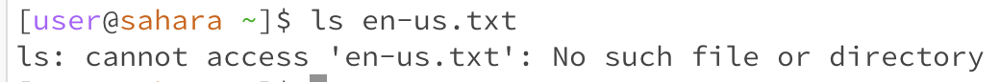
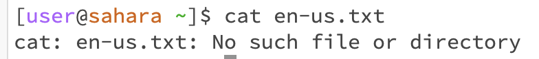

* The working directory is the home directory. There is no output because there was no specified directory. The output is not an error, since there is no output for cd.

* The working directory is the home directory. There is no output, but the directory was changed to lecture 1. The output is not an error, since there is no output for cd.

* The working directory is the home directory. There is an error output because the working directory is the home directory and the file is in a different directory. 

