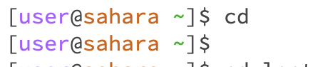
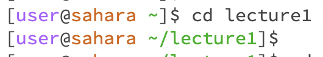
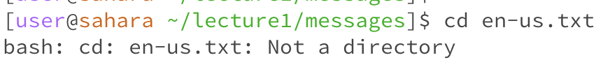
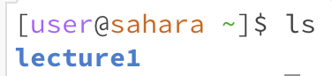
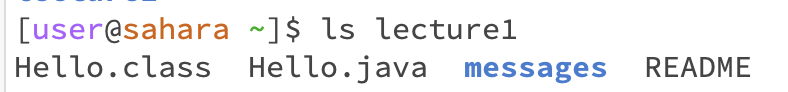
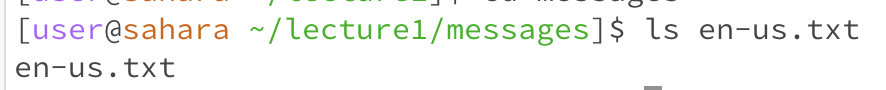
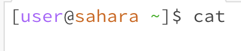
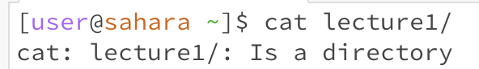
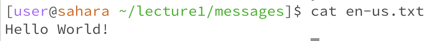

* The working directory is the `/home` directory. There is no output because there was no specified directory. The output is not an error, since there is no output for `cd`.

* The working directory is the `/home` directory. There is no output, but the directory was changed to `/lecture1`. The output is not an error, since there is no output for `cd`.

* The working directory is the `/messages` directory. There is an error output because the `cd` command changes the working directory, and `/en-us.txt` is not a directory.
  

* The working directory is the `/home` directory. The output is 'lecture1' because the `ls` command lists the files in the directory, and the `/lecture1` file is in the `/home` directory. The output is not an error.

* The working directory is the `/home` directory. The output is a list of the files in the `/lecture1` directory since the `ls` command lists the files in a given directory. The output is not an error.

* The working directory is the `/messages` directory. The output is 'en-us.txt' because that is the only file. The output is not an error.

* The working directory is the `/home` directory. There is no output. That `cat` command with no arguments will read data from the input and write them to its standard output. It is not an error.

* The working directory is the `/home` directory. The output states that `/lecture1` is a directory because a file needs to come after the `cat` command, not a directory. The output is not an error.

* The working directory is the `/messages` directory. The output is 'Hello World!' because that is the content of the `/en-us.txt` file. The output is not an error.
